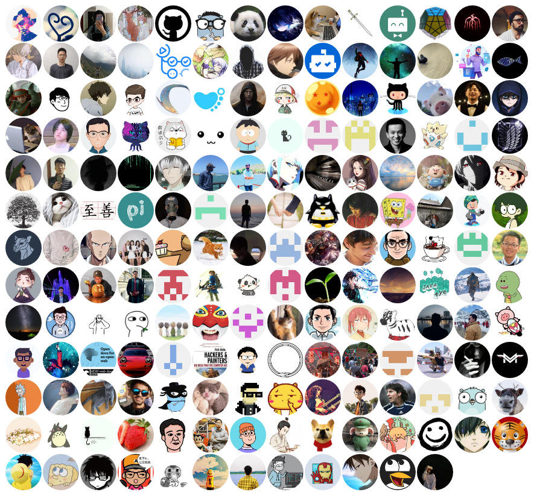

# 🌊自我介绍
```
我是一个生成 contribors.png 的 github-action，我和市面上其他的不一样，我专门解决整个 organize 的 commit 统计，以往只能针对仓库，使用我的话可以贴在社区主页的 .github 中
```

# 🍔 使用指南
### [示例仓库](https://github.com/thinkasany/test)
### md
```
<a href="https://thinkasany.github.io/test/" target="_blank"></a>
```

### pages
```
跳转链接是通过github-pages部署，源码放在 /demo/index.html 中
```

### yml配置
**orgName**, **github_token** 必填，其他选填
```
orgName: 'doocs' # 组织名字 如: doocs / hellof2e
github_token: ${{ secrets.GH_TOKEN }} # 自定义, 但是读写权限要配足
png_path: images-doocs/contributors.png # png上传的路径
json_path: json-doocs/data.json # json上传的路径
branch: 'master' # 不配置默认master分支
committer_name: 'think-bot' # 不配置默认 contributors bot
committer_email: 'thinkasany@163.com' # 不配置默认 actions@github.com
# limit_number: '10' # 不配置默认 '200'
# excludes_list: "ImgBotApp, github-actions[bot]" # 不配置默认为空, 不做过滤
# commit_message: 'chore: 自定义的message' # 不配置默认 chore: update contributors [skip ci]
```
### yml demo
```
name: test-doocs

on:
  schedule:
    - cron: "0 0 * * *"
  workflow_dispatch:

jobs:
  checkin:
    runs-on: ubuntu-latest
    steps:
      - uses: thinkasany/organize-contributors@master
        with:
          orgName: 'doocs'
          github_token: ${{ secrets.GH_TOKEN }}
          png_path: images-doocs/contributors.png
          json_path: json-doocs/data.json
          branch: 'master' # 不配置默认master分支
          committer_name: 'think-bot' # 不配置默认 actions-user
          committer_email: 'thinkasany@163.com' # 不配置默认actions@github.com
          # commit_message: 'chore: 自定义的message' # 不配置默认chore: update contributors [skip ci]
```

```
name: test-hellof2e

on:
  schedule:
    - cron: "0 0 * * *"
  workflow_dispatch:

jobs:
  checkin:
    runs-on: ubuntu-latest
    steps:
      - uses: thinkasany/organize-contributors@master
        with:
          orgName: 'hellof2e'
          github_token: ${{ secrets.GH_TOKEN }}
          png_path: images-hello/contributors.png
          json_path: json-hello/data.json
          branch: 'dev' # 不配置默认master分支
          committer_name: 'think-hello-bot' # 不配置默认 actions-user
          committer_email: 'thinkasany@163.com' # 不配置默认 action@gmail.com
          commit_message: 'chore: 自定义的message' # 不配置默认 chore: update contributors [skip ci]
```
# 🌈实现效果
<a href="https://thinkasany.github.io/test/" target="_blank"></a>